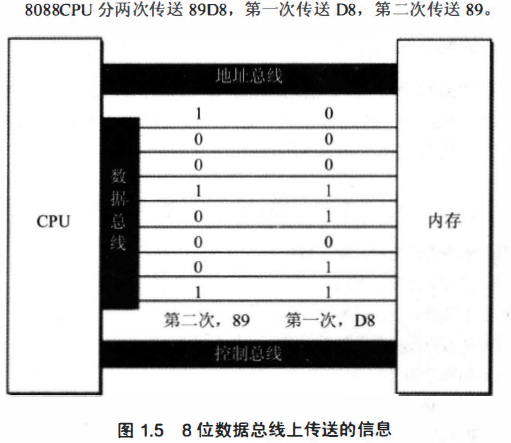
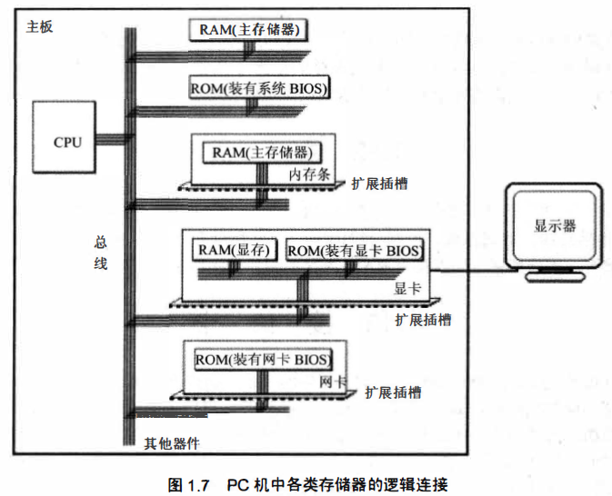
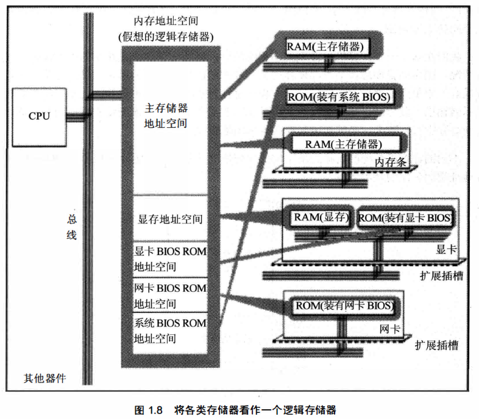

# 基础知识

**引言**

> 在本章中，我们对**硬件系统结构**的问题进行一部分的探讨，以使后续的课程可在一个好的基础上进行。
>
> **原则**是，以后用到的知识，以后再说。
>
> 汇编课程的**研究重点**放在如何利用硬件系统的编程结构和指令集**有效灵活地控制系统**进行工作。

# 一、机器语言

> **机器语言**是**机器指令的集合**
>
> **机器指令**展开来讲就是一台机器可以正确执行的**命令**。 
>
> **电子计算机的机器指令**是**一列二进制数字**。 计算机将之转变为一列**高低电平**，以便计算机的**电子器件受到驱动**，进行运算。
>
> 现在的PC机，通常用CPU（Central Processing Unit）来完成上面（早期）计算机的功能，CPU是一种**微处理器**

> **每一种微处理器**，由于**硬件设计和内部结构**的**不同**，就需要用不同的电平脉冲来控制，使它工作。

**早期**的程序设计均使用机器语言。 程序员们将用。**0、1数字**==编成的程序代码==打在**纸带或卡片**上，1打孔，0不打孔，再将程序通过纸带机或卡片机输入计算机，进行运算。

> 应用 8086CPU完成运算s =76 8+12288-1280，机器码如下。
>
> 101110000000000000000011 
> 000001010000000000110000 
> 001011010000000000000101
>
> 假如将程序错写成以下这样，请你找出错误。
>
> 101100000000000000000011
> 000001010000000000110000 
> 000101101000000000000101
>
> 哈哈哈，是不是很痛苦！这还只是个很简单的需求！
>
> 上面代码暴露除了机器码的**缺点**：**晦涩难懂**和**不易查错**

上面的例子可能短了点体验不到快乐，下面的例子绝对能让你倍感快乐！

> 在显示器上输出“welcometo masm”，机器码如下
>
> 
>
> 如何？此时如果其中有一个1写成了0，debug要de多久?

# 二、汇编语言的产生

**产生的原因**

> 机器语言难以辨别、记忆，发现问题...

**汇编语言**

> 汇编语言的主体是**汇编指令**。
>
> 汇编指令和机器指令的**差别**在于指令的**表示方法**上。
>
> 汇编指令是机器指令**便于记忆的书写格式**。

**举例**

> 操作：寄存器BX的内容送到AX中
>
> 机器指令：1000 1001 1101 1000
>
> 汇编指令：mov ax,bx
>
> **寄存器**
>
> - 简单地讲是**CPU中**可以**存储数据**的器件
> - **一**个CPU有**多**个寄存器
> - AX和BX是寄存器的名称

有了汇编语言后，程序员只需要写汇编语言而不用去写机器语言了！

**问题**：但是计算机只能读懂机器语言，读不懂汇编语言，所以这时候就需要一个“翻译员”（编译器）

> **编译器**：将**汇编指令**转换成**机器指令**的**翻译程序**
>
> 有了汇编语言后程序的编写：
>
> - 程序员编写汇编语言 --编译器->  机器语言 ----> 计算机执行

# 三、汇编语言的组成

汇编语言发展至今， 有以下**3类指令**组成。

> 1.**汇编指令**：机器码的**助记符**， **有对应**的**机器码**。
>
> 2.**伪指令**：**没有**对应的机器码， 由编译器**执行**， 计算机并**不执行**。
>
> 3.**其他符号**：如＋、 －、 ＊、／等， 由编译器**识别**， **没有**对应的机器码。
>
> 汇编语言的**核心**是**汇编指令**， 它决定了汇编语言的特性。

# 四、存储器

> 要灵活地利用汇编语言编程， 我们首先要了解 **CPU** 是如何从**内存**中**读取**信息， 以及向内存中**写入**信息的。
>

# 五、指令和数据

> **指令**和**数据**是**应用上的概念**
>
> 在内存或磁盘上， 指令和数据没有任何区别， **都是二进制信息**。
>
> **例如**， 内存中的二进制信息 1000100111011000，计算机可以把它看作大小为 89D8H的数据来处理， 也可以将其看作指令 mov ax,bx以来执行。
>
> 1000100111011000 一＞ 8908H （数据）
> 1000100111011000 一＞ mov ax,bx （程序）

# 六、存储单元

> 存储器被划分成若干个存储单元， 每个存储单元从0开始顺序编号， 例如一个存储器有 128 个存储单元， 编号从0~127，如图所示

>  **微型机**存储器的存储单元可以存储**一个 Byte**，即8 个二进制位。
>
> **微机存储器**的**容量**是以**字节为最小单位**来计算的。 对于拥有 128 个存储单元的存储器， 我们可以说， 它的容量是 128 个字节。
>
> 容量间的转换：
>
> 1KB = 1024B，1MB = 1024KB，1GB = 1024MB，1TB = 1024GB

# 七、CPU对内存的读写

> **CPU**要想进行**数据的读写**， 必须和外部器件（标准的说法是芯片）进行下面**3类**信息的交互。
>
> - 存储单元的**地址**（地址信息）
> - 器件的选择， 读或写的**命令**（控制信息）
> - 读或写的**数据**（数据信息）

**CPU是通过什么将地址、 数据和控制信息传到存储器芯片中的呢？**

> 电子计算机能处理、 传输的信息都是**电信号**， 电信号当然要用**导线传送**。 在计算机中专门有连接CPU 和其他芯片的导线， 通常称为**总线**。 总线从物理上来讲， 就是一根根导线的集合。
>
> 根据传送信息的不同， 总线从逻辑上又分为3类， **地址总线**、 **控制总线**和**数据总线**。

**CPU从3号单元中读取数据的过程（见图1.3）如下。**

> 1.CPU通过**地址线**将**地址信息 3** 发出。
>
> 2.CPU 通过**控制线**发出内存**读命令**， 选中存储器芯片， 并通知它， 将要从中读取数据
>
> 3.存储器将**3号单元中**的**数据8**通过**数据线**送入**CPU**。

**向3号单元==写入==数据26。**

> 1.CPU通过地址线将地址信息3发出。
>
> 2.CPU 通过控制线发出内存写命令， 选中存储器芯片， 并通知它， 要向其中写入数据
>
> 3.CPU通过数据线将数据26 送入内存的3号单元中。

**从上面我们知道了CPU是如何进行数据读写的。 可是， 如何==命令计算机进行数据的读写==呢？**

> 要让一个计算机或微处理器工作， 应向它**输入**能够**驱动**它进行工作的**电平信息**（机器码）。
>
> 对于**8086CPU**， 下面的机器码， 能够完成从3号单元读数据
>
> **机器码**：101000010000001100000000
>
> **含义**：从3号单元读取数据送入寄存器AX
>
> CPU接收这条机器码后将完成我们上面所述的读写工作。
>
> 机器码难于记忆， 用汇编指令来表
>
> 对应的**汇编指令**： MOV AX,[3]

# 八、地址总线

> CPU是通过**地址总线**来指定**存储器单元**的。 可见地址总线上能传送多少个不同的信息， CPU就 可以对多少个存储单元进行**寻址**。
>
> 假设一个CPU有10根地址总线，那么**寻址范围**为多少？因为**一根导线**可以传送的稳定状态只有两种，**高电平**和**低电平**，用二进制表示就是1和0，所以10根线能表示的个数为2^10 = **1024**，最小值为0，最大值为1023
>
> **总结**：一个CPU有**N根地址线**， 则可以说这个CPU 的地址总线的**宽度为N** 。 这样的CPU最多可以寻找**2的N次方**个内存单元。

# 九、数据总线

> CPU 与内存或其他器件之间的**数据传送**是通过**数据总线**来进行的。 数据总线的**宽度**决定了 CPU 和外界的数据**传送速度**。 **8 根数据总线**次可传送 个 **8 位二进制数据**（即一个字节）。 16 根数据总线 次可传送两个字节。

> **8088**CPU 的数据总线**宽度**为 **8**, **8086**CPU 的数据总线**宽度**为 **16**。 

> 8086 有16 根数据线， 可**一次**传送16 位数据， 所以可一次传送数据89D8H：而8088只有8 根数据线， 一次只能传8 位数据， 所以向内存写入数据89D8H 时需要进行**两次**数据传送。

# 十、控制总线

> CPU 对外部器件的**控制**是通过**控制总线**来进行的。
>
> **控制总线**是个总称， 控制总线是一些**不同控制线**的**集合**
>
> 控制总线的**宽度**决定了CPU 对外部器件的**控制能力**。

# 检测点

> 1. **13** （2^13 = 8*1024B = 8KB）
> 2. **10**  **0  1023** 
> 3. **10^13  10^10** 
> 4. **10^30 10^20 10^10**
> 5. **64  1  16  4**
> 6. **1  1  2  2  4**
> 7. **512  256**
> 8. **二进制**

# 十一、内存地址空间（概述）

> 什么是**内存地址空间**呢？举例来讲，一个CPU的地址**总线宽度为 10**，那么可以寻址 1024 个内存单元，这 **1024 个可寻到的内存单元**就构成这个CPU的内存地址空间。 

# 十二、主板

> 在每一台PC机中，都有一个主板，主板上有**核心器件**和一些**主要器件**，这些器件通过**总线**（地址总线、 数据总线、 控制总线）**相连**。 这些器件有CPU、存储器、 外围芯片组、 扩展插槽等。扩展插槽上一般插有RAM内存条和各类接口卡。

# 十三、接口卡

> 计算机系统中， 所有可用程序控制其工作的设备，必须受到CPU的控制。CPU对外部设备都不能直接控制，如显示器、 音箱、 打印机等。 直接控制这些设备进行工作的是插 在扩展插槽上的接口卡。扩展插槽通过总线和CPU相连，所以接口卡也通过总线同CPU 相连。CPU可以直接控制这些接口卡，从而实现CPU对外设的间接控制。 简单地讲，就 是**CPU通过总线向接口卡发送命令，接口卡根据CPU的命令控制==外设==进行工作**。

# 十四、各类存储器芯片

从**读写属性**上看分为两类：

> **随机存储器**（RAM)和**只读存储器**(ROM）。==随机存储器==可读可写，但必须**带电存储**，关机后存储的内容**丢失**：==只读存储器==**只能读取**不能写入，关机后其中的内容**不丢失**。

从**功能和连接**上又可分为以下几类。

> - 随机存储器
>     **用于存放供CPU使用的绝大部分程序和数据**，主随机存储器一般由两个位置上的RAM组成，装在主板上RAM和插在扩展插槽上的RAM。
>
> - 装有BIOS(Basic Input/Output System，基本输入／输出系统）的ROM
>     BIOS是由主板和各类接口卡（如显卡、网卡等）厂商提供的软件系统，可以**通过它利用该硬件设备进行最基本的输入输出**。在主板和某些接口卡上插有存储相应 BIOS的ROM。例如，主板上的ROM中存储着主板的BIOS（通常称为系统 BIOS：显卡上的ROM中存储着显卡的BIOS：如果网卡上装有ROM，那其中就可以存储网卡的BIOS
>
> - 接口卡上的RAM
>
>     **某些接口卡需要对大批量输入、输出数据进行暂时存储，在其上装有RAM**。最典型的是显示卡上的RAM，一般称为显存。显示卡随时将显存中的数据向显示 器上输出。换句话说，我们将需要显示的内容写入显存，就会出现在显示器上。

# 十五、内存地址空间

> 上述的那些存储器， 在**物理上**是**独立**的器件， 但是在以下两点上相同。
>
> - 都和CPU的总线相连。
> - CPU对它们进行读或写的时候都通过控制线发出内存读写命令。
>
> 这也就是说，CPU 在操控它们的时候， 把它们都**当作内存**来对待， 把它们总的看作一个由若干存储单元组成的**逻辑存储器**， 这个逻辑存储器就是我们所说的**内存地址空间**。
> 在汇编这门课中， 我们所面对的是内存地址空间。

> 在图1.8中， 所有的物理存储器被看作一个由若干存储单元组成的逻辑存储器， 每个物理存储器在这个逻辑存储器中占有一个**地址段**， 即一段地址空间。
>
> CPU 在这段地址空间中读写数据， 实际上就是在相对应的物理存储器中读写数据。

> 我们在基于一个计算机**硬件系统编程**的时候， 必须知道这个系统中的**内存地址空间分配**情况。因为当我们想在某类存储器中读写数据的时候， 必须知道它的**第一个单元的地址**和**最后一个单元的地址**， 才能保证读写操作是在预期的存储器中进行。
>
> 比如， 我们希望向显示器输出一段信息， 那么必须将这段信息写到显存中， 显卡才能将它输出到显示器上。要向显存中写入数据， 必须知道显存在内存地址空间中的地址。

> **不同的计算机**系统的内存**地址空间的分配**情况是**不同**的， 图1.9 展示了8086PC 机内存地址空间分配的基本情况。

> 图1.9 告诉我们， 从地址0～ 9FFFF 的内存单元中读取数据， 实际上就是在读取**主随机存储器**中的数据： 
>
> 向地址 A0000～BFFFF 的内存单元中写数据， 就是向**显存**中写入数据， 这些数据会被显示卡输出到显示器上： 
>
> 我们向地址 C0000-FFFFF 的内存单元中写入数据的操作是**无效**的， 因为这等于改写**只读存储器**中的内容。

****

